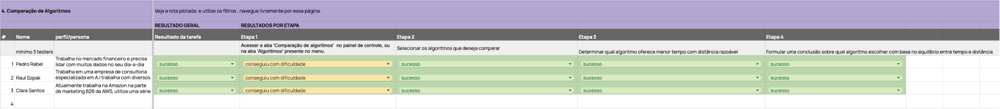

# Testes de Usabilidade

## Introdução
&emsp;&emsp;Os testes de usabilidade são essenciais para desenvolver sites que não apenas atendam às expectativas dos usuários, mas também ofereçam uma experiência agradável e eficiente. Este artigo detalha como nossa equipe aplicou testes de usabilidade direcionados para avaliar e aprimorar nosso site. Através de sessões interativas de feedback de usuários, focamos em compreender as experiências, as dificuldades e as preferências dos usuários ao navegar em nosso site. Tais testes são cruciais para identificar barreiras não evidentes no design e na funcionalidade que podem afetar negativamente a interação do usuário. O objetivo é garantir que o site seja intuitivo, acessível e acolhedor para todos os visitantes, melhorando continuamente com base em suas impressões e sugestões reais.

&emsp;&emsp;A escolha de Clara Santos, Pedro Rebel e Raul Szpak para participar dos testes de usabilidade foi motivada por seus respectivos papéis profissionais e experiências com tecnologias similares, proporcionando uma visão valiosa sobre a usabilidade e funcionalidade da plataforma.

- **Clara Santos** é de Produto para Soluções de Otimização de Logística na Amazon AWS, onde lidera o desenvolvimento e o marketing de produtos que utilizam algoritmos avançados para otimizar rotas e cadeias de suprimentos. Sua experiência garante que as soluções tecnológicas não apenas aumentem a eficiência operacional, mas também melhorem a satisfação do cliente em ambientes corporativos. Sua expertise em marketing B2B e tecnologia a torna uma candidata ideal para avaliar nossa plataforma, especialmente em termos de interface de usuário e funcionalidades de otimização de processos.

- **Pedro Rebel** trabalha como Especialista em Análise de Dados e Otimização de Operações Financeiras, utilizando plataformas que empregam algoritmos avançados para simular e otimizar rotas de transação e alocação de recursos no mercado financeiro. Seu trabalho diário com grandes volumes de dados e sua capacidade de aumentar a eficiência operacional, reduzir custos e maximizar lucros para instituições financeiras o qualificam de forma excepcional para testar a funcionalidade e a eficácia da nossa ferramenta de comparação de algoritmos.

- **Raul Szpak** atua como Consultor de Inovação em Algoritmos de Otimização com foco em IA, auxiliando empresas a implementar soluções tecnológicas que otimizam processos, desde logística até operações internas. Sua posição em uma empresa de consultoria especializada em IA e seu envolvimento no desenvolvimento de soluções inovadoras e eficientes o tornam um avaliador crítico das funcionalidades avançadas da plataforma, com um olhar focado na usabilidade e na aplicação prática dos algoritmos.

&emsp;&emsp; Esses perfis foram selecionados por serem representativos de nossos usuários-alvo, que se beneficiariam diretamente das funcionalidades do site, garantindo assim que o feedback coletado seja relevante e direcionado para melhorias que atendam às necessidades específicas de usuários que lidam com desafios semelhantes em seus respectivos campos.
### Teste 1 
- **Objetivo:** Este teste foi desenhado para avaliar quão intuitivo é o processo de login e acesso à principal funcionalidade da plataforma, a tela de upload. Consideramos essencial que os usuários possam iniciar suas atividades na plataforma sem impedimentos.
- **Procedimento:** Solicitamos a três usuários com diferentes níveis de habilidade técnica para realizar o login e navegar até a tela de upload.

  
<b>Figura 1 </b> - Teste 1

  
  
Fonte: Elaboração Onda

| #   | Nome        | Perfil/Persona                                                       | Resultado da Tarefa | Etapa 1 - Resultado            |
|-----|-------------|----------------------------------------------------------------------|---------------------|---------------------------------|
| 1   | Pedro Rebel | Trabalha no mercado financeiro e precisa lidar com muitos dados diários| Sucesso             | Clicar no botão 'Entrar': Sucesso|
| 2   | Raul Szpak  | Trabalha em uma empresa de consultoria especializada em AI            | Sucesso             | Clicar no botão 'Entrar': Sucesso|
| 3   | Clara Santos| Atualmente trabalha na Amazon na parte de marketing B2B da AWS       | Sucesso             | Clicar no botão 'Entrar': Sucesso|

- **Resultado:** Pedro Rebel, Raul Szpak e Clara Santos completaram a tarefa com sucesso, indicando uma experiência de usuário positiva e livre de complicações.
- **Análise Detalhada:** A eficácia com que todos os testers concluíram esta tarefa sugere que nossa interface de login está bem configurada e é amigável, mesmo para usuários que podem não ter muita familiaridade com tecnologias semelhantes.
- **Conclusão:** O sucesso nesta etapa do teste demonstra que o processo de entrada na plataforma é robusto e eficiente. Continuaremos monitorando esta funcionalidade para garantir que mantenha sua eficácia conforme o site evolui.

### Teste 2

- **Objetivo:** Testamos a facilidade de upload de arquivos CSV e a subsequente seleção de algoritmos de processamento. Esse teste é crucial pois essas são funcionalidades centrais da nossa plataforma.
- **Procedimento:** Pedimos que os mesmos três usuários carregassem um arquivo e selecionassem um algoritmo de processamento a partir de um menu dropdown.

  
<b>Figura 2 </b> - Teste 2

  
  
Fonte: Elaboração Onda

| #   | Nome        | Perfil/Persona                                                       | Resultado da Tarefa | Etapa 1 - Resultado                              | Etapa 2 - Resultado                             | Etapa 3 - Resultado                              |
|-----|-------------|----------------------------------------------------------------------|---------------------|---------------------------------------------------|--------------------------------------------------|---------------------------------------------------|
| 1   | Pedro Rebel | Trabalha no mercado financeiro e precisa lidar com muitos dados diários| Sucesso             | Selecionar 'Upload de arquivos': Sucesso          | Arrastar o arquivo CSV: Sucesso                  | Selecionar algoritmo e clicar 'Enviar': Sucesso   |
| 2   | Raul Szpak  | Trabalha em uma empresa de consultoria especializada em AI            | Sucesso             | Clicar em 'Selecionar um arquivo': Sucesso        | Arrastar o arquivo CSV: Sucesso                  | Selecionar algoritmo e clicar 'Enviar': Dificuldade|
| 3   | Clara Santos| Atualmente trabalha na Amazon na parte de marketing B2B da AWS       | Sucesso             | Selecionar 'Upload de arquivos': Sucesso          | Arrastar o arquivo CSV: Sucesso                  | Selecionar algoritmo e clicar 'Enviar': Sucesso   |

- **Resultado:** Pedro Rebel e Clara Santos não enfrentaram dificuldades, enquanto Raul Szpak encontrou alguns problemas para selecionar o algoritmo desejado.

- **Análise Detalhada:** A dificuldade de Raul indica uma possível área de melhoria na clareza ou usabilidade do menu dropdown, que pode ser confuso ou não muito intuitivo para alguns usuários.
- **Conclusão:** Apesar do sucesso geral, o feedback de Raul é uma oportunidade valiosa para revisar e potencialmente simplificar essa interface. Ajustes podem ser necessários para tornar a seleção de algoritmos mais acessível e compreensível para todos os usuários.

### Teste 3

- **Objetivo:** Este teste focou em avaliar como os usuários interagem com a funcionalidade de comparação de algoritmos, especialmente em termos de facilidade de uso e eficácia na apresentação de informações comparativas.
- **Procedimento:** Os participantes foram instruídos a usar a ferramenta de comparação para escolher o melhor algoritmo baseado em tempo e distância.

  
<b>Figura 3 </b> - Teste 3

  
  
Fonte: Elaboração Onda

| #   | Nome        | Perfil/Persona                                                       | Resultado da Tarefa | Etapa 1 - Resultado                               | Etapa 2 - Resultado                              | Etapa 3 - Resultado                              |
|-----|-------------|----------------------------------------------------------------------|---------------------|----------------------------------------------------|---------------------------------------------------|---------------------------------------------------|
| 1   | Pedro Rebel | Trabalha no mercado financeiro e precisa lidar com muitos dados diários| Conseguiu Com Dificuldade             | Acessar a aba 'Comparação de algoritmos': Sucesso  | Selecionar os algoritmos para comparar: Não Conseguiu   | Analisar resultados: Conseguiu Com Dificuldade                     |
| 2   | Raul Szpak  | Trabalha em uma empresa de consultoria especializada em AI            | Sucesso             | Acessar a aba 'Comparação de algoritmos': Sucesso  | Selecionar os algoritmos para comparar: Não Conseguiu   | Analisar resultados: Sucesso                     |
| 3   | Clara Santos| Atualmente trabalha na Amazon na parte de marketing B2B da AWS       |  Conseguiu Com Dificuldade              | Acessar a aba 'Comparação de algoritmos': Sucesso  | Selecionar os algoritmos para comparar: Não Conseguiu   | Analisar resultados: Conseguiu Com Dificuldade                     |

- **Resultado:** Todos os participantes conseguiram completar a tarefa, mas notaram que a navegação inicial poderia ser aprimorada.
- **Análise Detalhada:** Os comentários sugerem que, embora a funcionalidade seja útil, a interface inicial pode ser complexa ou confusa, o que dificulta a compreensão rápida e eficaz dos dados apresentados.
- **Conclusão:** A ferramenta de comparação é funcional, mas o design da interface necessita de refinamentos para melhorar a experiência do usuário. Investiremos em melhorias na clareza visual e na intuitividade da navegação.

### Teste 4
- **Objetivo:** Avaliar a continuidade da usabilidade da ferramenta de comparação de algoritmos, com foco específico na capacidade dos usuários de formular conclusões sobre qual algoritmo escolher com base no equilíbrio entre tempo e distância.
- **Procedimento:** Continuação do Teste 3, pedimos que os usuários formassem uma conclusão final sobre a escolha do algoritmo.

  
<b>Figura 1 </b> - Teste 4 

  
  
Fonte: Elaboração Onda

| #   | Nome         | Perfil/Persona                                                           | Resultado da Tarefa | Etapa 1                                                | Etapa 2                                            | Etapa 3                                                                        | Etapa 4                                                                        |
|-----|--------------|--------------------------------------------------------------------------|---------------------|--------------------------------------------------------|----------------------------------------------------|--------------------------------------------------------------------------------|--------------------------------------------------------------------------------|
| 1   | Pedro Rebel  | Trabalha no mercado financeiro e precisa lidar com muitos dados diários  | Sucesso             | Acessar a aba 'Comparação de algoritmos': Conseguiu com dificuldade | Selecionar os algoritmos que deseja comparar: Sucesso | Determinar qual algoritmo oferece menor tempo com distância razoável: Sucesso | Formular uma conclusão sobre qual algoritmo escolher com base no equilíbrio entre tempo e distância: Sucesso |
| 2   | Raul Szpak   | Trabalha em uma empresa de consultoria especializada em AI               | Sucesso             | Acessar a aba 'Comparação de algoritmos': Conseguiu com dificuldade | Selecionar os algoritmos que deseja comparar: Sucesso | Determinar qual algoritmo oferece menor tempo com distância razoável: Sucesso | Formular uma conclusão sobre qual algoritmo escolher com base no equilíbrio entre tempo e distância: Sucesso |
| 3   | Clara Santos | Atualmente trabalha na Amazon na parte de marketing B2B da AWS           | Sucesso             | Acessar a aba 'Comparação de algoritmos': Conseguiu com dificuldade | Selecionar os algoritmos que deseja comparar: Sucesso | Determinar qual algoritmo oferece menor tempo com distância razoável: Sucesso | Formular uma conclusão sobre qual algoritmo escolher com base no equilíbrio entre tempo e distância: Sucesso |

- **Resultado:** Todos os usuários conseguiram formular uma decisão informada, destacando a utilidade prática da ferramenta.
- **Análise Detalhada:** Este teste reforçou a importância de uma interface de comparação eficaz, mas também destacou a necessidade de melhorias contínuas para facilitar a tomada de decisão.
- **Conclusão:** Os resultados positivos confirmam a eficácia da funcionalidade, mas também apontam para a necessidade de aprimoramentos contínuos para manter a plataforma alinhada com as melhores práticas de usabilidade.

## Conclusão

&emsp;&emsp;No primeiro teste, focado no processo de login e acesso à funcionalidade principal, a maioria dos usuários concluiu a tarefa sem problemas, indicando uma interface de login bem configurada e amigável. No segundo teste, que avaliou o upload de arquivos e a seleção de algoritmos, houve um feedback positivo geral, mas algumas dificuldades foram encontradas na seleção dos algoritmos por um dos usuários. Isso apontou para uma área de melhoria na clareza da interface. O terceiro teste abordou a funcionalidade de comparação de algoritmos. Embora todos os participantes tenham conseguido realizar a tarefa, alguns apontaram dificuldades na navegação inicial, sugerindo a necessidade de melhorias na interface. O quarto teste, uma continuação do terceiro, focou na capacidade dos usuários de formular conclusões a partir dos dados apresentados. Todos conseguiram fazer isso, destacando a utilidade prática da ferramenta, mas também evidenciando a importância contínua de refinamentos na interface.

&emsp;&emsp;Com base nos resultados dos testes realizados, pode-se concluir que a interface do sistema teve uma boa recepção geral, mas também destacou áreas específicas que precisam de melhorias. O processo de login e acesso às funcionalidades principais foi considerado bem configurado e amigável pela maioria dos usuários, indicando um bom ponto de partida. No entanto, foram identificadas algumas dificuldades na seleção de algoritmos e na navegação inicial em algumas partes do sistema, sugerindo a necessidade de melhorias na clareza e usabilidade da interface nessas áreas específicas. Apesar desses desafios, os participantes foram capazes de realizar as tarefas propostas e formular conclusões a partir dos dados apresentados, destacando a utilidade prática da ferramenta. Assim, conclui-se que refinamentos contínuos na interface são importantes para otimizar a experiência do usuário e garantir a eficácia do sistema como um todo.

&emsp;&emsp;A realização dos testes de usabilidade em nosso site revelou insights valiosos, que foram instrumentalizados para realizar melhorias tangíveis na interface e na experiência geral do usuário. O feedback direto dos usuários permitiu-nos entender melhor quais aspectos do site estavam funcionando bem e quais precisavam de ajustes. Como resultado, conseguimos implementar mudanças que tornaram o site mais amigável e funcional. Essa abordagem centrada no usuário não apenas melhorou a satisfação e a retenção do usuário, mas também reforçou a importância de um diálogo contínuo com nossos visitantes para evoluir e adaptar nosso espaço digital de forma responsiva. Seguiremos comprometidos com este ciclo de feedback e melhorias, assegurando que nosso site continue a atender eficazmente às necessidades de nossos usuários.
