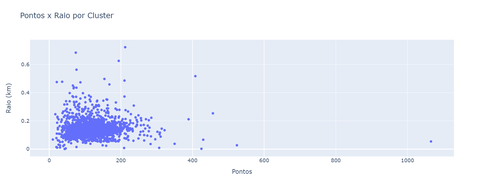
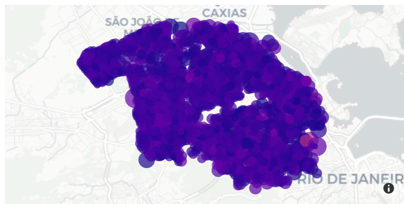

# Sumário

1. [Introdução](#introdução)
2. [Trabalhos relacionados](#trabalhos-relacionados)
3. [Resultados](#resultados)
   - [Clusterização](#clusterização)
   - [Algoritmo de Christofides](#algoritmo-de-christofides)
   - [Análise de Rotas](#análise-de-rotas)
4. [Conclusão](#conclusão)

# Introdução

&emsp;&emsp;O setor de saneamento básico enfrenta desafios contínuos para manter a eficiência operacional e a sustentabilidade de seus serviços, especialmente em grandes empresas como a Aegea Saneamento e Participações S.A., líder no setor privado no Brasil. Um dos maiores desafios operacionais é a leitura de hidrômetros, um processo essencial para o registro do consumo de água e subsequente faturamento. Este processo envolve logística complexa, considerando a vasta área de cobertura e o elevado número de clientes atendidos, e tem impacto direto no faturamento e na satisfação do cliente (Moura, 2019). Ineficiências nesta operação podem resultar em atrasos na emissão de contas, erros de faturamento e insatisfação do cliente, afetando a imagem e a operacionalidade da empresa (Santos, 2018).

&emsp;&emsp;Dada a necessidade crítica de otimizar esse processo, este projeto foi desenvolvido para a Aegea com o objetivo de melhorar as rotas de leitura dos hidrômetros, maximizando a eficiência ao minimizar o tempo e a distância percorrida pelos leituristas, assegurando a cobertura completa dentro dos ciclos de leitura estabelecidos (Oliveira & Hara, 2015). A solução proposta envolve o uso do algoritmo de Christofides, além de testes com o Simulated Annealing e Nearest Neighbors, adaptados às especificidades e desafios enfrentados pela Aegea. Problemas relacionados, como o Problema do Caixeiro Viajante, servem de base teórica para a abordagem de otimização adotada (Cunha, Bonasser & Abrahão, 2002). A implementação desta solução não apenas visa reduzir custos operacionais e melhorar a precisão das leituras, mas também alinhar as operações com as estratégias de sustentabilidade da empresa (Ali, 2015).

&emsp;&emsp;Este artigo explora as técnicas de otimização de rotas aplicadas ao contexto da Aegea, discutindo como essas técnicas podem ser adaptadas e implementadas para resolver o problema apresentado. O estudo fundamenta-se em uma revisão da literatura sobre métodos de otimização, como o Problema do Caixeiro Viajante e suas variações, e suas aplicações em contextos similares, fornecendo um suporte teórico robusto para a solução proposta (Cunha, Bonasser & Abrahão, 2002). Ademais, o projeto segue uma metodologia ágil, estruturada em várias sprints que permitem uma abordagem iterativa e incremental no desenvolvimento da solução, garantindo flexibilidade e adaptabilidade às necessidades emergentes da Aegea durante o projeto (Cáceres Cruz et al., 2024).

&emsp;&emsp;Ao maximizar a eficiência das rotas de leitura dos hidrômetros, o projeto não apenas contribui para a melhoria das operações da Aegea, mas também oferece insights valiosos para o setor de saneamento, onde a precisão na leitura de hidrômetros é crucial para o faturamento e a sustentabilidade operacional.

## Trabalhos relacionados

&emsp;&emsp;Nessa seção serão explorados alguns artigos com desafios comuns ao projeto do grupo Onda, a fim de analisar informações que podem ser úteis para a execução do presente projeto.

&emsp;&emsp;O artigo *Experimentos computacionais com heurísticas de melhorias para o problema do caixeiro viajante* (Cunha, 2022) explora alguns métodos de construção de roteiros para o Problema do Caixeiro Viajante (PCV) e heurísticas para melhorar os resultados obtidos. Entre os métodos citados, destaca-se o método do vizinho mais próximo, onde o caixeiro inicia em uma cidade qualquer e segue para a cidade mais próxima ainda não visitada, repetindo esse processo até que todas as cidades sejam visitadas e ele retorne à origem. Explica também os métodos de inserção, que começam com um roteiro contendo duas cidades e vão inserindo, sucessivamente, a cidade que atende a um critério específico, como a menor distância adicional.

&emsp;&emsp;Outros métodos abordados são as heurísticas baseadas em árvores de cobertura mínima, que utilizam a árvore de cobertura mínima para guiar a construção do roteiro. O método das economias de Clarke e Wright é também discutido, no qual as cidades são agrupadas com base nas economias de distância resultantes da sua união, considerando a distância de cada ponto ao ponto inicial e entre os pontos.

&emsp;&emsp;A análise dos diferentes métodos de construção de rotas mostrou a importância da solução inicial na qualidade das soluções obtidas pelos métodos 2-opt e 3-opt. Quando os métodos de melhoria começam com soluções de qualidade inferior, eles não conseguem compensar totalmente, resultando em soluções inferiores.

&emsp;&emsp;No projeto Onda, essa conclusão se torna relevante porque demonstra que a implementação de uma boa solução inicial pode levar a uma melhoria significativa. Se a rota inicial for mal otimizada, mesmo as melhorias subsequentes podem não atingir a eficiência desejada.

&emsp;&emsp;O artigo de John Nerlder, publicado em 1965, introduz uma técnica de otimização projetada para minimizar funções de múltiplas variáveis. O método Nelder-Mead(Nelder, 1965), ou método do simplex descendente, não requer informações de gradiente, tornando-o particularmente útil para problemas nos quais as derivadas são difíceis ou impossíveis de calcular. O método opera usando um simplex, uma figura geométrica formada por $n+1$ vertices em um espaço $n$-dimensional e ajusta iterativamente o simplex para convergir para o mínimo da função. 

&emsp;&emsp;O algoritmo Nelder-Mead envolve várias etapas: reflexão, expansão, contração e encolhimento. Cada etapa manipula o simplex com base nos valores da função em seus vértices, com o objetivo de melhorar a aproximação do mínimo. A reflexão move o simplex para longe do ponto pior, a expansão o estende se o ponto refletido for melhor, a contração o puxa de volta se a reflexão falhar, e o encolhimento reduz seu tamanho em torno do melhor ponto, se necessário. Este método é amplamente utilizado devido à sua simplicidade e eficácia em várias aplicações práticas, apesar de sua natureza heurística e eventuais problemas de convergência.

&emsp;&emsp;As variantes do Nelder-Mead e outros métodos de otimização podem ser utilizados para otimizar as soluções aproximadas do TSP, por exemplo, ajustando os parâmetros de um algoritmo de busca heurística, como o algoritmo genético, a busca tabu e o simulated annealing, que são frequentemente utilizados para resolver o TSP.

&emsp;&emsp;No contexto do projeto Onda, onde o Simulated Annealing foi aplicado, o método Nelder-Mead pode ser considerado uma alternativa viável para otimizar soluções aproximadas do Problema do Caixeiro Viajante ao usar o Simulated Annealing para explorar amplamente o espaço de solução, permitindo aceitar soluções piores de forma controlada, enquanto usa o Nelder-Mead para refinamento local em torno de soluções promissoras encontradas pelo Simulated Annealing.

&emsp;&emsp;A pesquisa sobre o Problema de Roteamento de Veículos (PRV) evoluiu consideravelmente, abordando diversas complexidades e variações práticas, como discutido no levantamento abrangente "Rich Vehicle Routing Problem Survey" (Cáceres Cruz et al., 2014). Este estudo oferece uma visão detalhada sobre as diferentes variações do PRV, incluindo restrições adicionais como janelas de tempo, capacidade de veículos e rotas múltiplas. Ao abordar essas variações, o artigo fornece uma base teórica rica para a aplicação de algoritmos de otimização em contextos empresariais complexos. Ele destaca como os avanços na pesquisa de roteamento podem ser adaptados para resolver problemas práticos de logística, onde múltiplas restrições e objetivos precisam ser equilibrados.

&emsp;&emsp;O artigo "From Single-Objective to Multi-Objective Vehicle Routing Problems: Motivations, Case Studies, and Methods" (Jozefowiez et al., 2008), explora a transição de problemas de roteamento de veículos de um único objetivo para múltiplos objetivos. Este artigo aborda as motivações por trás da consideração de múltiplos objetivos, como a minimização simultânea do custo total de transporte e a maximização da satisfação do cliente. Ele também apresenta estudos de caso que demonstram a aplicação de métodos de otimização multiobjetivo em contextos reais. Esses exemplos ilustram como os métodos de otimização podem ser adaptados para lidar com diferentes prioridades e restrições, proporcionando soluções eficientes e equilibradas para problemas de roteamento complexos.

# Resultados

&emsp;&emsp;Nesta seção, serão apresentados os resultados obtidos a partir da aplicação das técnicas de clusterização e otimização de rotas. Primeiramente, será discutida a clusterização dos pontos de leitura de hidrômetros, explicando a metodologia adotada e os resultados alcançados. Em seguida, será abordada a aplicação do algoritmo do caixeiro viajante dentro dos clusters gerados, detalhando a solução proposta e os resultados obtidos. A análise é fundamental para avaliar a viabilidade e a eficiência das rotas otimizadas, bem como para identificar áreas de melhoria para futuras implementações.

### Clusterização

#### Objetivo Inicial e Resultados Esperados

&emsp;&emsp;O objetivo inicial desta análise é separar aproximadamente 380 mil pontos em agrupamentos viáveis para serem rodados no algoritmo do caixeiro viajante. A clusterização visa criar grupos de pontos que podem ser percorridos de forma eficiente, facilitando a criação de rotas otimizadas para a leitura de hidrômetros. A expectativa é que essa estratégia possibilite a formação de posteriores rotas para todo o conjunto de dados.

#### Importância da Clusterização

&emsp;&emsp;A clusterização dos dados é uma etapa crítica para otimizar as rotas de leitura de hidrômetros. Agrupar pontos geograficamente próximos permite criar rotas de leitura que minimizam a distância e o tempo de deslocamento dos leituristas. A clusterização é essencial para evitar processamento desnecessário de um algoritmo de rotas em todos os pontos, o que seria inviável em termos de tempo e recursos computacionais.

#### Metodologia e Decisão dos Parâmetros de Clusterização

&emsp;&emsp;Para determinar o número adequado de clusters, foram testados diferentes valores manualmente e iterativamente para encontrar uma configuração que resultasse em pontos e raios viáveis, além de validações com o parceiro de projeto nas entregas das *sprints* 2 e 3. A metodologia envolveu a comparação do número de pontos por cluster e o raio do cluster, utilizando como referência os pontos médios nas rotas originais da Aegea, e posterior testagem do algoritmo do caixeiro viajante para uma parcela dos clusters.

#### Escolha de 150 Clusters e 22 Subclusters

&emsp;&emsp;Após várias iterações e comparações, foi decidido utilizar 150 clusters, cada um subdividido em 22 subclusters. Essa configuração resultou em uma média de 114 pontos por cluster e um raio médio de 133 metros do centróide. Esses valores foram considerados viáveis pelo parceiro da Aegea para serem resolvidos diariamente pelos leituristas.

### Resultados da Execução dos Clusters

&emsp;&emsp;A execução da clusterização resultou na criação de 3300 clusters. Os principais indicadores observados foram:

- **Raio Médio dos Centróides:** 0.1332 km
- **Número Médio de Pontos por Cluster:** 114.6 pontos

#### Análise dos Gráficos

&emsp;&emsp;A análise do gráfico de dispersão de pontos por cluster x raio do cluster revelou que:

- Em áreas muito densas de pontos, o raio do cluster tende a ser menor.
- Em áreas menos densas, o raio do cluster é maior.

  
<b>Figura 1 </b> - Gráfico de Número de Pontos x Raio (km) por Cluster

  
  
Fonte: Elaboração Onda

&emsp;&emsp;Essa tendência indica que a clusterização está se ajustando bem às diferentes densidades de pontos, garantindo que os clusters sejam compactos em áreas densas e mais abrangentes em áreas dispersas.

### Visualização dos Clusters

&emsp;&emsp; Abaixo está uma visualização dos centróides dos clusters gerados no mapa. Cada ponto no mapa representa um centróide, com o tamanho do ponto indicando o raio do cluster e a cor representando o número de pontos no cluster.

  
<b>Figura 2 </b> - Visualização dos Clusters

  
  
Fonte: Elaboração Onda

### Tempo de Execução e Especificações do Hardware

&emsp;&emsp;A execução dos algoritmos de clusterização foi realizada utilizando a biblioteca *Scikit-Learn* e *MiniBatch KMeans* em um computador com as seguintes especificações:

- **Processador:** Intel Core i5
- **Memória RAM:** 8 GB
- **Tempo de Execução:** Aproximadamente 37 segundos

### Resultados do Algoritmo do Caixeiro Viajante

&emsp;&emsp;A partir da análise de clusterização realizada, é possível aplicar o problema do caixeiro viajante dentro de cada cluster gerado de forma mais rápida e eficiente. A estratégia envolve cortar a última aresta (a maior) do percurso, pois não há necessidade de retornar ao ponto inicial. Caso alguma rota exceda o tempo diário permitido de 6 horas, ela é subdividida, garantindo que o leiturista não ultrapasse o tempo de trabalho permitido. No entanto, essa subdivisão não é feita de forma ótima e deve ser aprimorada em futuras etapas do algoritmo.

### Algoritmo de Christofides

&emsp;&emsp;O algoritmo de Christofides é utilizado para resolver o problema do caixeiro viajante (TSP). Este algoritmo é uma aproximação que garante uma solução com um custo no máximo 1,5 vezes o custo da solução ótima. Ele é especialmente útil em problemas onde é necessário encontrar uma solução eficiente com resultado esperado, em situações que a solução exata é computacionalmente inviável.

#### Passos do Algoritmo de Christofides

1. **Gerar a Árvore Geradora Mínima (MST):** Criar uma árvore geradora mínima a partir do grafo completo dos pontos.
2. **Encontrar os Nós de Grau Ímpar:** Identificar os vértices com grau ímpar na MST.
3. **Emparelhamento Mínimo de Nós Ímpares:** Criar um emparelhamento mínimo entre os nós de grau ímpar.
4. **Unir as Arestas:** Adicionar as arestas do emparelhamento à MST para formar um multigrafo Euleriano.
5. **Caminho Euleriano e Conversão em Caminho Hamiltoniano:** Encontrar um caminho Euleriano e convertê-lo em um caminho Hamiltoniano, cortando a última aresta para formar um caminho completo e não um ciclo.

&emsp;&emsp; De acordo com Christofides (1976), o processo descrito leva em torno de $O(n^3)$, indicando que o tempo de execução cresce de forma exponencial com o número de hidrômetros a serem avaliados, visto que todos os pontos são avaliados, independentemente de já ter ou não encontrado a solução ótima. A complexidade e a garantia de no máximo 1.5 vezes o custo ótimo se dá da seguinte forma:

**Árvore Geradora Mínima (MST)**:

-   O peso da MST, $w(T)$, é no máximo o peso do percurso TSP ótimo, $w(OPT)$, porque remover uma aresta do percurso TSP gera uma árvore geradora. Portanto, $w(T) \leq w(OPT)$.

**Emparelhamento de Peso Mínimo (M)**:

-   Seja $O$ o conjunto de vértices de grau ímpar em $T$. Pelo Lema do Aperto de Mãos, o número de vértices de grau ímpar é par, então existe um emparelhamento perfeito.
-   O peso do emparelhamento de peso mínimo $M$ em $O$, $w(M)$, é no máximo metade do peso do percurso TSP ótimo, $w(OPT)$. Portanto, $w(M) \leq 0.5 \cdot w(OPT)$.

**Circuito Euleriano e Eliminação de Vértices Repetidos**:

-   O grafo combinado $G'$ com arestas $T \cup M$ é euleriano, com todos os vértices tendo grau par. Encontrando um circuito euleriano em $G'$ dá um percurso que visita cada vértice pelo menos uma vez.
-   A eliminação dos vértices repetidos resulta em um ciclo hamiltoniano cujo peso é no máximo o peso do circuito euleriano. Assim, o peso do ciclo hamiltoniano é no máximo $w(T) + w(M) \leq w(OPT) + 0.5 \cdot w(OPT) = 1.5 \cdot w(OPT)$.

**Indução para Generalização da Prova**:

-   **Caso Base**: Para $n = 3$ vértices, o algoritmo constrói diretamente o único percurso possível.
-   **Hipótese de indução**: Assumindo uma aproximação de 3/2 para qualquer grafo com $n$ vértices.
-   **Passo de indução**: Remover um vértice, aplicar o algoritmo aos $n$ vértices restantes, e então reintroduzir o vértice removido. Isso não aumenta a razão de aproximação além de 3/2, pois os passos adicionais seguem os mesmos princípios.

### Resultados do Algoritmo de Christofides nos Clusters

&emsp;&emsp;O algoritmo de Christofides foi aplicado aos clusters gerados para determinar as rotas de leitura de hidrômetros. A última aresta foi cortada para formar um caminho completo em vez de um ciclo.

#### Cálculo de Tempo por Rota

&emsp;&emsp;O cálculo do tempo por rota considerou o tempo de deslocamento entre os pontos e o tempo gasto na leitura de cada hidrômetro. A velocidade média de deslocamento foi assumida como 5 km/h e o tempo de leitura como 2 minutos por hidrômetro. A distância entre os pontos foi calculada a partir das coordenadas geográficas, usando a fórmula de Haversine.

### Execução Parcial e Considerações Finais

&emsp;&emsp;O algoritmo foi executado para apenas 50% dos clusters devido ao alto tempo de execução. Na próxima etapa, o objetivo é rodar o algoritmo para todos os clusters. O output fornece as rotas otimizadas e o número de leituristas necessários para cobrir todas as rotas de leitura de hidrômetros em um csv.

#### Tempo de Execução e Especificações do Hardware

A execução dos algoritmos foi realizada utilizando a biblioteca *NetworkX*, do *Python*, em um computador com as seguintes especificações:

- **Processador:** Intel Core i5
- **Memória RAM:** 8 GB
- **Tempo de Execução:** Aproximadamente 17 horas para 50% dos clusters

&emsp;&emsp;Ao aplicar o algoritmo do *MiniBatch KMeans* pelo método de Lloyd, observa-se uma mudança na complexidade computacional. Antes do *clustering*, o tempo de execução é denominado pelo produto do número de pontos $𝑛$, o número de iterações $𝑖$, e o número de atributos $𝑑$. Após o *clustering*, o tempo de execução é o produto do número de pontos, o número de subclusters $𝑚$, e o número de atributos. Considerando que o número de subclusters é significativamente menor do que o número total de pontos, isso reduz o tempo de execução. Isso ocorre devido à diminuição da complexidade do algoritmo, uma vez que ele opera em subconjuntos menores de dados, resultando em uma otimização do processo computacional.

## Análise de Rotas

#### Arquivo CSV de Rotas
&emsp;&emsp; O arquivo CSV gerado contém detalhes cruciais para a análise e otimização das rotas. Ele é processado por um Notebook (`codigo/algoritmo/new_algorithm_analisys.ipynb`) 10 que visualiza os clusters e gera estatísticas das rotas, assim como toda a análise de resultados que serão abordados nessa sessão do algoritmo. As colunas do arquivo são:
- **CLUSTER**: Identificador do cluster.
- **ROTA**: Identificador da rota dentro do cluster.
- **INDICE**: ID único para cada ponto.
- **LATITUDE**, **LONGITUDE**: Coordenadas geográficas do ponto.
- **CODIGO_ROTA**: Código referencial da rota.
- **SEQUENCIA**: Ordem de visita dos pontos.
- **LOGRADOURO**: Nome da rua ou localização.
- **NUMERO**: Número do local no endereço.

&emsp;&emsp; O arquivo é essencial para a análise detalhada e a otimização das rotas realizadas pelos leituristas no campo. Ele fornece uma visão estruturada e precisa de como os pontos de interesse estão distribuídos geograficamente e como eles são sequenciados em cada rota dentro de seus respectivos clusters. Essa organização é fundamental para maximizar a eficiência das rotas, minimizando o tempo de viagem e os custos associados.

### Pontos por Rota 
&emsp;&emsp; A distribuição dos pontos por rota é uma análise crucial para otimizar o planejamento e a execução de rotas logísticas ou de serviços. Ao entender a densidade de pontos em cada rota, é possível ajustar os recursos necessários, como o número de veículos ou colaboradores, para garantir uma cobertura eficiente e minimizar o tempo de deslocamento. Essa análise também contribui para a tomada de decisões estratégicas, como a realocação de pontos entre rotas para melhor balanceamento e eficiência geral. A visualização dos pontos por rota pode ser encontrada no arquivo anexo indicado, proporcionando uma visão detalhada da distribuição. 10.

  
<b>Figura 1 </b>- Pontos por Rota 

  
  
Fonte: Elaboração G2

&emsp;&emsp; A análise da distribuição de pontos por rota revelou uma média de 100,74 pontos por rota. Esse resultado sugere que as rotas estão bem distribuídas em termos de volume de pontos. No entanto, para garantir a máxima eficiência, é essencial considerar não apenas a quantidade de pontos, mas também a proximidade entre eles e o tipo de serviço ou entrega realizada em cada ponto. Um planejamento eficaz das rotas, que leve em conta todos esses aspectos, pode resultar em uma redução significativa do tempo de trânsito e um aumento na produtividade geral das operações.

### Tempo Médio de Execução por ponto
&emsp;&emsp; O tempo médio de execução por ponto é uma métrica essencial que combina o tempo de deslocamento entre pontos com o tempo de parada necessário em cada local. Este indicador é fundamental para avaliar a eficiência das rotas planejadas. Ao analisar essa métrica, é possível identificar gargalos operacionais e ajustar o itinerário ou o tempo de parada em determinados pontos para otimizar a rota. Melhorar o tempo médio de execução pode significar uma redução significativa nos custos operacionais e um aumento na satisfação dos clientes ou usuários finais devido à agilidade no serviço prestado. A análise detalhada desses tempos por rota auxilia na constante busca por eficiência operacional e qualidade no atendimento.

  
<b>Figura 2 </b>- Tempo por Rota 

  
  
Fonte: Elaboração Onda

&emsp;&emsp;O tempo médio de execução por ponto foi calculado em 2,74 minutos (2 minutos e 44 segundos), considerando tanto o tempo necessário para o leiturista chegar ao ponto quanto o tempo que ele permanece no local. Essa análise destaca a necessidade de otimizar ambos os aspectos: os tempos de parada e os de deslocamento. Estratégias como revisar as rotas existentes e adotar tecnologias de roteamento inteligente podem contribuir para a redução do tempo médio por ponto, aumentando a eficiência operacional e aprimorando a qualidade do serviço.

## Avaliação da Viabilidade das Rotas

&emsp;&emsp; A seguinte análise foca em determinar a viabilidade das rotas com base em um limite estrito de 6 horas por dia de trabalho. Esta restrição é vital para garantir uma gestão eficiente do tempo e maximizar a produtividade sem sobrecarregar a força de trabalho.

### Análise de Viabilidade
&emsp;&emsp;  O gráfico abaixo (Figura 3) apresenta uma análise detalhada da distribuição de rotas viáveis em comparação com rotas inviáveis, levando em consideração o limite de 6 horas por rota. Esse gráfico foi gerado a partir de dados coletados durante o período de avaliação, onde cada rota foi cuidadosamente monitorada para garantir precisão nos resultados. A distinção entre rotas viáveis e inviáveis é crucial para otimizar a eficiência operacional, permitindo ajustes necessários para maximizar a produtividade e minimizar o tempo ocioso. Ao analisar esse gráfico, é possível identificar padrões e tendências que podem influenciar futuras estratégias de planejamento e execução de rotas.

  
<b>Figura 3 </b>- Quantidade de Rotas Viáveis 

  
  
Fonte: Equipe de Desenvolvimento G2

&emsp;&emsp; O gráfico abaixo (Figura 3) apresenta uma análise detalhada da distribuição de rotas viáveis em comparação com rotas inviáveis, levando em consideração o limite de 6 horas por rota. Com base nesse gráfico, foram identificadas várias rotas não viáveis, o que representa um problema significativo no algoritmo utilizado. Esta descoberta destaca a necessidade de refinamento do algoritmo para garantir que todas as rotas estejam dentro do limite de tempo estabelecido, otimizando a eficiência operacional e assegurando a viabilidade de todas as rotas planejadas.

### Estudo de Caso: Uma Rota Não Viável
&emsp;&emsp;Também foi examinado casos específicos onde as rotas se mostraram inviáveis. A Figura 4 apresenta uma rota que não cumpriu a restrição de tempo, levando um total de 8,55 horas para ser completada, o que contradiz com o limite de 6 horas por rota.

  
<b>Figura 4 </b>- Exemplo de Rota Não Viável 

  
  
Fonte: Equipe de Desenvolvimento G2

### Implicações e Próximos Passos
&emsp;&emsp; Os insights obtidos desta análise são fundamentais para refinar nossas estratégias de planejamento de rotas. Ao entender os fatores que contribuem para ineficiências, podemos implementar melhorias direcionadas para aprimorar a produtividade geral e a aderência às restrições de tempo.

## Comparação de Rotas

&emsp;&emsp;A figura abaixo apresenta uma comparação entre rotas utilizadas por duas trajetórias, identificadas como Aegea e Grupo Onda, em uma área específica da cidade do Rio de Janeiro, com foco em uma rota de um ponto aleatório de latitude -22.813896 e longitude -43.325649. A análise visualiza como cada grupo aborda a cobertura territorial através de suas rotas operacionais.

  
<b>Figura 5 </b>- Comparação de Rotas 

  
  
Fonte: Elaboração Onda

&emsp;&emsp; A rota azul, correspondente ao Grupo Onda, mostra uma distribuição mais ampla comparada à rota vermelha da Aegea, que se concentra em um setor mais restrito. Embora a rota do Grupo Onda apresente outliers, ou seja, pontos que se desviam do padrão geral das rotas, ela já demonstra uma semelhança significativa em cobrir áreas mais extensas comparativamente. As linhas vermelhas são densamente agrupadas em uma área específica, sugerindo um caminho ou rotas altamente concentradas. As linhas azuis, por outro lado, se estendem por uma área mais ampla, indicando uma distribuição de rota mais abrangente, mas de um jeito ruim levando em conta os outliers. Este mapeamento visual permite identificar oportunidades de otimização e ajustes nas rotas para melhor eficiência e cobertura. 

### Análise de Rotas com Trajetória Ineficiente

&emsp;&emsp; Uma rota zigue-zague ocorre quando o trajeto faz com que o leiturista cruze a mesma rua várias vezes para alcançar diferentes pontos. Por exemplo, o leiturista pode atravessar uma rua para ir a uma casa, depois atravessar novamente para visitar outra casa mais próxima, em vez de percorrer toda a extensão de uma rua antes de seguir para a próxima. Isso resulta em um aumento desnecessário de tempo e esforço. Uma rota mais eficiente percorreria toda uma rua antes de seguir para a próxima, minimizando a necessidade de cruzamentos repetidos e otimizando o tempo de deslocamento.

#### Exemplo de Rota Ineficiente

&emsp;&emsp; Durante a análise, algumas rotas apresentaram trajetórias ineficientes, caracterizadas por movimentos de zigue-zague que cruzam repetidamente a mesma rua. Este comportamento não é esperado e indica uma área de melhoria para o algoritmo. A figura abaixo mostra uma dessas rotas, destacando a necessidade de otimizar o algoritmo para evitar tais padrões.

  
<b>Figura 6 </b>- Exemplo 2 de Rota Não Viável 

  
  
Fonte: Elaboração Onda

#### Próximos Passos

&emsp;&emsp;Os resultados destacam uma oportunidade de melhoria não abordada na SPRINT 4 do projeto. O próximo passo incluirá o desenvolvimento de uma solução para otimizar essas rotas e eliminar movimentos ineficientes, garantindo uma navegação mais direta e lógica. Para isso, será necessário:

1. **Limite de Tempo por Rota**: Implementar uma lógica que garanta que cada rota não ultrapasse o limite de 6 horas. Caso uma rota exceda esse tempo, o algoritmo deve ser capaz de quebrar essa rota em segmentos menores e mais gerenciáveis.

2. **Minimização de Rotas Zig-Zag**: Ajustar o algoritmo para evitar padrões de zigue-zague, que são ineficientes e aumentam o tempo de percurso desnecessariamente.

3. **Consideração de Barreiras Físicas e Viabilidade das Rotas**: Incorporar dados geográficos detalhados e algoritmos de pathfinding que reconhecem barreiras físicas, como rodovias e rios, pode melhorar significativamente a lógica de roteamento.

4. **Estudo de Viabilidade das Rotas**: Considerar a viabilidade das rotas em termos de acesso e permissões legais para uso de certas vias, especialmente em áreas urbanas complexas ou zonas restritas.

&emsp;&emsp; Estes ajustes não só melhorarão a eficiência das rotas mas também contribuirão para a satisfação dos usuários finais, otimizando recursos e tempo. Implementar essas mudanças será um passo crucial na evolução do projeto.

# Conclusão

&emsp;&emsp;Os resultados do algoritmo de Christofides aplicados aos clusters gerados mostram que é possível otimizar as rotas de leitura de hidrômetros de forma eficiente. A subdivisão das rotas garante que o tempo de trabalho diário não seja excedido, e o cálculo do tempo por rota ajuda a planejar a alocação de leituristas. Embora o tempo de execução seja alto, a próxima etapa visa rodar o algoritmo para todos os clusters. Um problema que posteriormente deve ser resolvido pelo algoritmo é o de cruzamentos nas ruas, que geram zigue-zagues indesejados nas rotas, além de colocar a segurança do leiturista em risco.

# Referências Bibliográficas

1. Ali, N. M. (2015). Optimization of Meter Reading Routes Using GIS. Universiti Teknologi Malaysia. Retrieved from [http://eprints.utm.my/81487/1/NurhasyimahMohamadAliMFKM2015.pdf](http://eprints.utm.my/81487/1/NurhasyimahMohamadAliMFKM2015.pdf)

2. Cáceres Cruz, J., Arias, P., Guimaraes, D., & Riera, D. (2014). Rich Vehicle Routing Problem Survey. Retrieved from [https://www.researchgate.net/publication/266912841_Rich_Vehicle_Routing_Problem_Survey](https://www.researchgate.net/publication/266912841_Rich_Vehicle_Routing_Problem_Survey)

3. Cunha, Claudio & Bonasser, Ulisses & Abrahão, Fernando. (2002). **Experimentos computacionais com heurísticas de melhorias para o problema do caixeiro viajante.** Disponível em: [https://www.researchgate.net/profile/Claudio-Cunha-3/publication/228434832_Experimentos_computacionais_com_heuristicas_de_melhorias_para_o_problema_do_caixeiro_viajante/links/54803ccb0cf2ccc7f8bb2c18/Experimentos-computacionais-com-heuristicas-de-melhorias-para-o-problema-do-caixeiro-viajante.pdf](https://www.researchgate.net/profile/Claudio-Cunha-3/publication/228434832_Experimentos_computacionais_com_heuristicas_de_melhorias_para_o_problema_do_caixeiro_viajante/links/54803ccb0cf2ccc7f8bb2c18/Experimentos-computacionais-com-heuristicas-de-melhorias-para-o-problema-do-caixeiro_viajante.pdf) Acesso em: 15 mai. 2024

4. GreenTech Environmental. (2022). Sustainable practices in the sanitation sector. Retrieved from [https://greentechenvironmental.com/sustainable-sanitation](https://greentechenvironmental.com/sustainable-sanitation)

5. Jozefowiez, N., Semet, F., & Talbi, E. (2008). From Single-Objective to Multi-Objective Vehicle Routing Problems: Motivations, Case Studies, and Methods. European Journal of Operational Research, 189(2), 293-309. Retrieved from [https://www.researchgate.net/publication/227040360_From_Single-Objective_to_Multi-Objective_Vehicle_Routing_Problems_Motivations_Case_Studies_and_Methods](https://www.researchgate.net/publication/227040360_From_Single-Objective_to_Multi-Objective_Vehicle_Routing_Problems_Motivations_Case_Studies_and_Methods)

6. NELDER, J. A.; MEAD, R. A. **A simplex method for function minimization**. Computer Journal, v.7, p. 308-313, 1965. Disponível em: [https://www.ime.unicamp.br/~sandra/MT853/handouts/Ref3(NelderMead1965).pdf](https://www.ime.unicamp.br/~sandra/MT853/handouts/Ref3(NelderMead1965).pdf). Acesso em: 16 mai. 2024

7. Oliveira, M. J., & Hara, S. R. (2015). Otimização de Rotas de Leitura de Medidores de Água com o Uso de Algoritmos Genéticos. Faculdade de Engenharia da Universidade do Porto. Retrieved from [https://paginas.fe.up.pt/~shrha/publicacoes/pdf/JHRHA_8as/11_MJOliveira_Otimiza%C3%A7%C3%A3o_FINAL.pdf](https://paginas.fe.up.pt/~shrha/publicacoes/pdf/JHRHA_8as/11_MJOliveira_Otimiza%C3%A7%C3%A3o_FINAL.pdf)

8. Zhang, J., Xu, M., & Lin, Y. (2012). An Efficient Routing Algorithm for Meter Reading System. _IEEE Transactions on Smart Grid_. Retrieved from [https://ieeexplore.ieee.org/abstract/document/6257426](https://ieeexplore.ieee.org/abstract/document/6257426)

9. Zhou, Y., Wang, Y., Zhang, J., & Xia, J. (2016). Sustainability of Urban Water Resources: Water Use, Pollution, and Management. Sustainability, 8(12), 1289. Retrieved from [https://www.mdpi.com/2071-1050/8/12/1289](https://www.mdpi.com/2071-1050/8/12/1289)